# [TIV-2025] Degradation Modeling for Restoration-enhanced Object Detection in Adverse Weather Scenes
Xiaofeng Wang, Xiao Liu, Hong Yang, Zhengyong Wang, Xiaoyue Wen, [Xiaohai He]([‪https://scholar.google.com.hk/citations?user=go3zwMMAAAAJ&hl=zh-CN), [Linbo Qing](https://scholar.google.com.hk/citations?hl=zh-CN&user=0KRDflwAAAAJ), and [Honggang Chen](https://scholar.google.com/citations?user=qkpb0CMAAAAJ)

[Paper](https://ieeexplore.ieee.org/document/10636782)

## :bulb: Abstract

> **Abstract:** Object detection is widely applied in fields such as scene perception and intelligent driving. However, interfered by degradations such as rain, haze, and snow, object detection in adverse weather conditions pose significant challenges. Mainstream methods usually fail to take into account the object detection of degraded images and cannot effectively handle them. In this paper, we present a Restoration-enhanced object detection network for adverse weather scenes enabled by Degradation Modeling, dubbed RDMNet. Firstly, to capture more potential information of degraded images, we incorporate the idea of restoration into the detection network, thus forming a dual branch network. Secondly, to improve the network's adaptability for different weather types, we propose to model the degradation of degraded images and learn its multi-scale degradation representations to guide the feature transformation in both restoration and detection branches. Finally, to facilitate the cross-task integration of restoration and detection branches, we develop a multi-scale bi-directional feature fusion block and propose a restoration weight decay training strategy. Extensive experiments in rain, haze, and snow weathers demonstrate that our RDMNet outperforms the recent object detection approaches.
>
> 

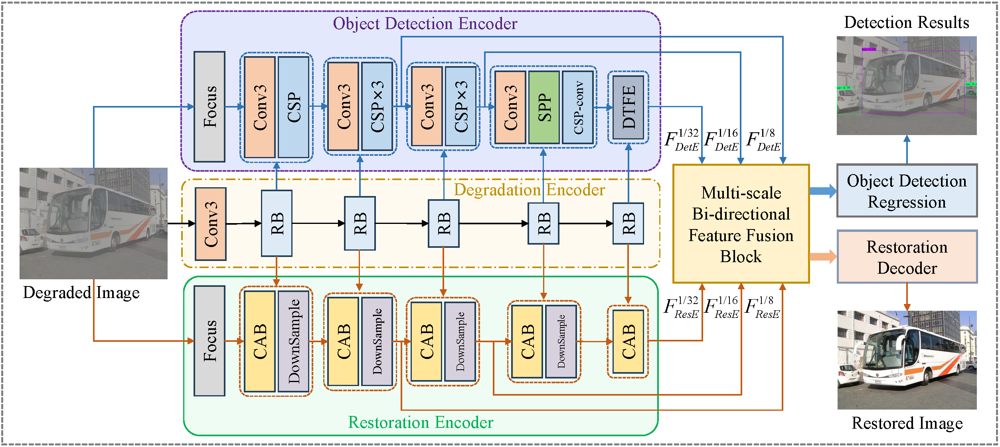

<hr />

## :rocket: Installation

This model is built in PyTorch 1.10.1 and trained on Ubuntu 20.04 environment (Python 3.8, CUDA 11.7). 

1. Clone our repository

   ```
   git clone https://github.com/xfwang23/RDMNet.git
   cd RDMNet
   ```

<hr />

## :computer: Usage

### 1. Dataset Preparation

We conduct experiments on three weather conditions, including rain, haze, and snow. The training and testing datasets are elaborated in the following, you can download the whole dataset [here](https://pan.baidu.com/s/154AKOqyzmt2SNZdIIDD6sA?pwd=avnk).

- As for clean images for synthesizing the degraded images, the [VOC dataset](http://host.robots.ox.ac.uk/pascal/VOC/voc2012/) is selected, and we name it <u>**VOC-Clean**</u>. It includes 9,578 clean images for training and 2,129 clean images for testing. 
- As for Rain weather condition, we synthesize the rainy images by the code in `utils/Rain_Synthesizing.py` based on the clean images of VOC dataset, then we construct a rainy dataset named **<u>VOC-Rain</u>**, which consists of  VOC-Rain-train that contains 9,578 rainy images for training and VOC-Rain-test that contains 2,129 rainy images for testing. 
- As for Haze weather condition, we adopt the hazy dataset synthesized by [TogetherNet](https://github.com/yz-wang/TogetherNet) named **<u>VOC-FOG</u>**,  it consists of  VOC-FOG-train that contains 9,578 hazy images for training and VOC-FOG-test that contains 2,129 hazy images for testing. Additionally, we also adopt the real-world hazy datasets to test the performance of our method, including <u>**Foggy Driving dataset**</u> and <u>**RTTS**</u>.
- As for Snow weather condition, we synthesize the snowy images by the code in `utils/Snow_Synthesizing.py` based on the clean images of VOC dataset and snow masks of [CSD dataset](https://github.com/weitingchen83/ICCV2021-Single-Image-Desnowing-HDCWNet), then we construct a snowy dataset named **<u>VOC-Snow</u>**, which consists of  VOC-Snow-train that contains 9,578 snowy images for training and VOC-Snow-test that contains 2,129 snowy images for testing. 
- As for unified object detection in multiple weather scenes, we combine the above four training sets to form a mixed dataset for model's training, and test its performance on their respective test sets (VOC-Clean-test, VOC-Rain-test, VOC-Haze-test, VOC-Snow-test).

It is recommended to put the above four datasets to a directory. We have provided the image paths and labels in text files for training and testing in `Datasets/`, and also, you can generate yourself text files by running `voc_annotation.py`.

The datasets structure is as follows

```
YourDatasetsDirectory/
├─VOC-Clean
│  ├─ImageSets
│  ├─test
│  └─train
├─VOC-Rain
│  ├─ImageSets
│  ├─test
│  └─train
├─VOC-FOG
│  ├─ImageSets
│  ├─test
│  └─train
├─VOC-Snow
│  ├─ImageSets
│  ├─test
│  └─train
...
```

<hr />

### 2. Training

In `train.py`,  you need to modify the `dataset_dir` to your dataset directory and select `weather` to the weather that you want to conduct experiments, then run

```
python train.py
```

<hr />

### 3. Testing

Modify the `model_path` to your pretrained weights path in `yolo.py` and fill in the path of your test sets in `gep_map.py`, then run `get_map.py` by

```
python get_map.py 
```

<hr />

### 4. Predict

Modify the `model_path` path to your pretrained weights path in `yolo.py` and the `mode`, `dir_origin_path`, and `dir_save_path` in `predict.py`, then run

```
python predict.py 
```

<hr />

## :sparkles: Experimental Results

We perform experiments on four object detection patterns, including rainy, hazy, snowy image object detection, and unified object detection on these three weathers. Their experimental results are shown in the following

<details>
  <summary> <strong>Rainy Image Object Detection</strong> (click to expand) </summary>
<table>
  <tr>
    <td><p align="center">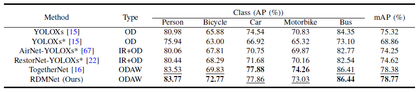 </td>
  </tr>
  <tr>
    <td><p align="center"><b>Quantatitive results of rainy image object detection.</b></p></td>
  </tr>
  <tr>
    <td><p align="center">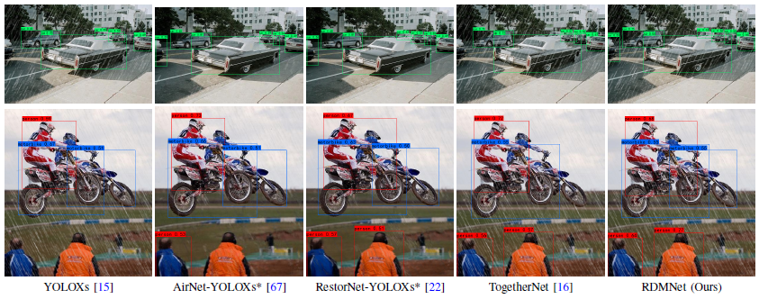 </td>
  </tr>
  <tr>
    <td><p align="center"><b>Visual results of rainy image object detection.</b></p></td>
  </tr>
</table></details>

<details>
  <summary> <strong>Hazy Image Object Detection</strong> (click to expand) </summary>
<table>
  <tr>
    <td><p align="center">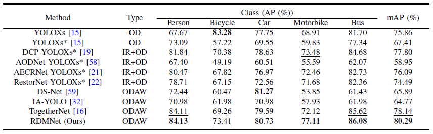 </td>
  </tr>
  <tr>
    <td><p align="center">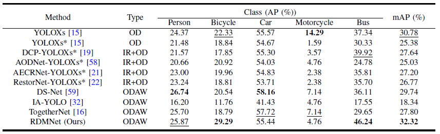 </td>
  </tr>
  <tr>
    <td><p align="center">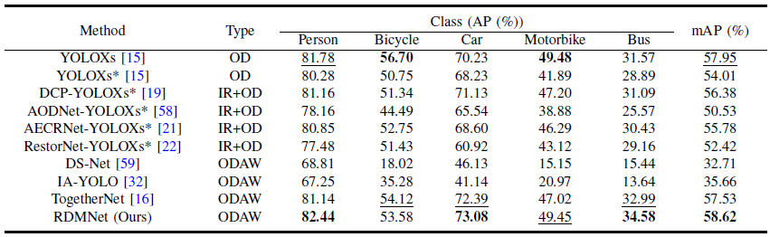 </td>
  </tr>
  <tr>
    <td><p align="center"><b>Quantatitive results of hazy image object detection.</b></p></td>
  </tr>
  <tr>
    <td><p align="center">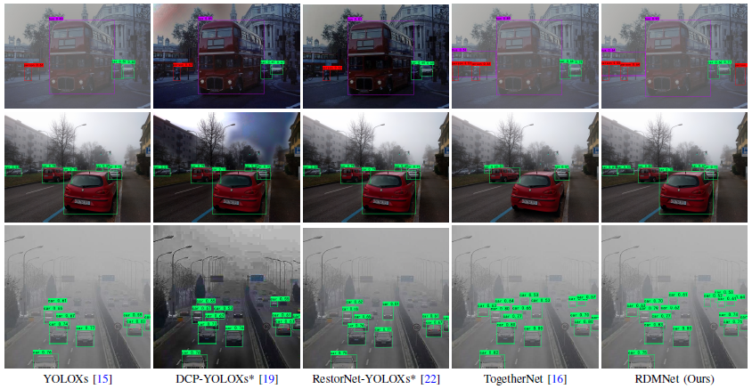 </td>
  </tr>
  <tr>
    <td><p align="center"><b>Visual results of hazy image object detection.</b></p></td>
  </tr>
</table></details>

<details>
  <summary> <strong>Snowy Image Object Detection</strong> (click to expand) </summary>
<table>
  <tr>
    <td><p align="center">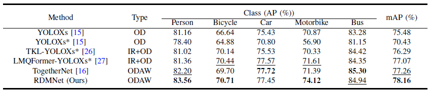 </td>
  </tr>
  <tr>
    <td><p align="center"><b>Quantatitive results of Snowy image object detection.</b></p></td>
  </tr>
  <tr>
    <td><p align="center">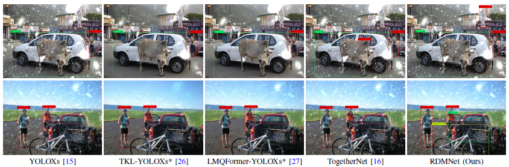 </td>
  </tr>
  <tr>
    <td><p align="center"><b>Visual results of Snowy image object detection.</b></p></td>
  </tr>
</table></details>

<details>
  <summary> <strong>Unified Object Detection in Multiple Weather Scenes</strong> (click to expand) </summary>
<table>
  <tr>
    <td><p align="center">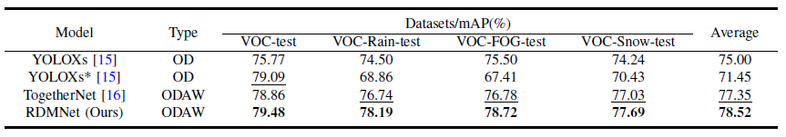 </td>
  </tr>
  <tr>
    <td><p align="center"><b>Quantatitive results of unified object detection.</b></p></td>
  </tr>
  <tr>
    <td><p align="center">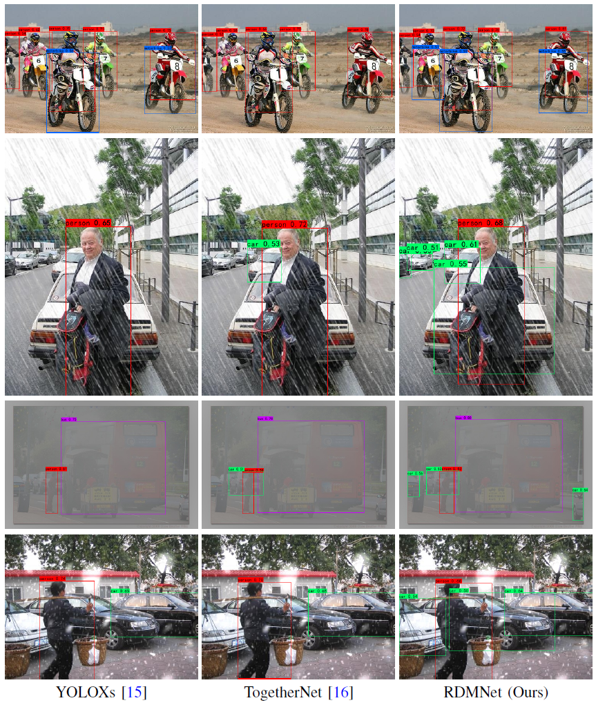 </td>
  </tr>
  <tr>
    <td><p align="center"><b>Visual results of unified object detection.</b></p></td>
  </tr>
</table></details>

<hr />

## :e-mail: Contact
Should you have any question, please create an issue on this repository or contact at xfwang23@foxmail.com and  liuxmail1220@gmail.com.

<hr />

## :heart: Acknowledgement
We thank [TogetherNet](https://github.com/yz-wang/TogetherNet) and [YOLOXs](https://github.com/Megvii-BaseDetection/YOLOX) for their excellent baseline to promote the development of our work.

<hr />

## :pray: Citation
If this work is helpful for you, please consider citing:

```
@ARTICLE{RDMNet,
  author={Wang, Xiaofeng and Liu, Xiao and Yang, Hong and Wang, Zhengyong and Wen, Xiaoyue and He, Xiaohai and Qing, Linbo and Chen, Honggang},
  journal={IEEE Transactions on Intelligent Vehicles}, 
  title={Degradation Modeling for Restoration-enhanced Object Detection in Adverse Weather Scenes}, 
  year={2025},
  volume={10},
  number={3},
  pages={2064-2079},
  doi={10.1109/TIV.2024.3442924}}
```

